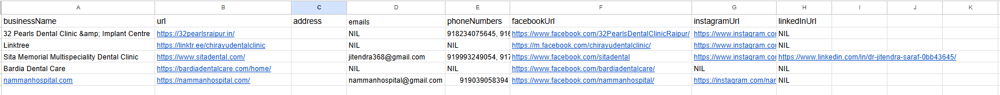

# ai-lead-generation-system
Automated Google Maps lead generation system using AI-powered scraping and workflow automation.

# 🚀 AI Lead Intelligence & Business Data Extraction System  
### Automated Google Maps Scraper + Multi-Channel Business Data Aggregation Engine

A scalable AI-powered lead intelligence system that extracts enriched business data from Google Maps and associated digital channels to generate structured, high-quality B2B leads.

Designed for agencies, sales teams, and automation-driven businesses.

---

## 🚨 The Problem

Modern businesses struggle with:

- Manual lead research
- Incomplete contact information
- Fragmented data across platforms
- Low-quality prospect targeting
- Time-consuming verification

Traditional scraping tools extract only partial information — limiting outreach effectiveness.

---

## 💡 The Solution

This AI-driven automation system:

- 🔍 Extracts businesses from Google Maps based on targeted keywords
- 📊 Collects enriched data including:
  - Business Name
  - Website URL
  - Physical Address
  - Emails
  - Phone Numbers
  - Facebook URL
  - Instagram URL
  - LinkedIn URL
- 🧹 Structures and cleans raw data
- ⚙️ Automates large-scale lead generation
- 📁 Stores ready-to-use leads in organized database/sheets

---

## 📦 Extracted Data Fields

| Field | Description |
|-------|------------|
| businessName | Registered business name |
| url | Official website |
| address | Physical business location |
| emails | Extracted contact emails |
| phoneNumbers | Verified phone numbers |
| facebookUrl | Facebook business page |
| instagramUrl | Instagram business profile |
| linkedInUrl | LinkedIn company page |

---

## 🏗 System Architecture

1️⃣ Keyword-Based Business Targeting  
2️⃣ Google Maps Data Extraction  
3️⃣ Website Crawling for Contact Information  
4️⃣ Social Media Link Detection  
5️⃣ Data Structuring & Cleaning  
6️⃣ Automated Storage (Google Sheets / Database)  

> ⚠️ Core scraping logic and workflow automation are proprietary and not publicly shared due to commercial deployment.

---

## 🛠 Tech Stack

- n8n (Workflow Orchestration)
- Google Maps Data Extraction Logic
- Automated Web Crawling
- REST APIs
- Structured Data Parsing
- Google Sheets API / Database Integration
- Scalable Automation Architecture

---

## 📊 Impact (Simulated Deployment Metrics)

- ⚡ 500+ enriched leads extracted per session
- 📈 80% reduction in manual prospecting time
- 📊 Multi-platform data aggregation (Maps + Website + Social)
- 💼 Designed for scalable B2B outreach automation

---

## 🎯 Use Cases

- Digital Marketing Agencies
- Local Business Prospecting
- Appointment Setting Teams
- B2B Sales Automation
- Growth Marketing Workflows

---

## 📸 Demo Preview

(Add screenshots below)

---

## 🧠 Why This Project Matters

This project demonstrates:

- Advanced automation engineering
- Real-world data extraction workflows
- Multi-source data aggregation
- Business-ready lead structuring
- Scalable automation design
- SaaS-ready system architecture

---

## 📩 Contact

Gurpreet Singh  
AI Automation & Workflow Engineer  
📧 gpssingh277@gmail.com
